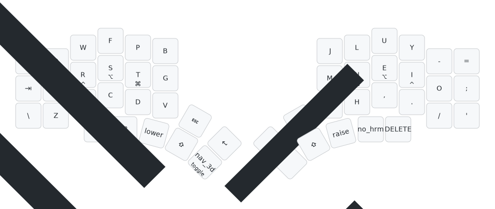
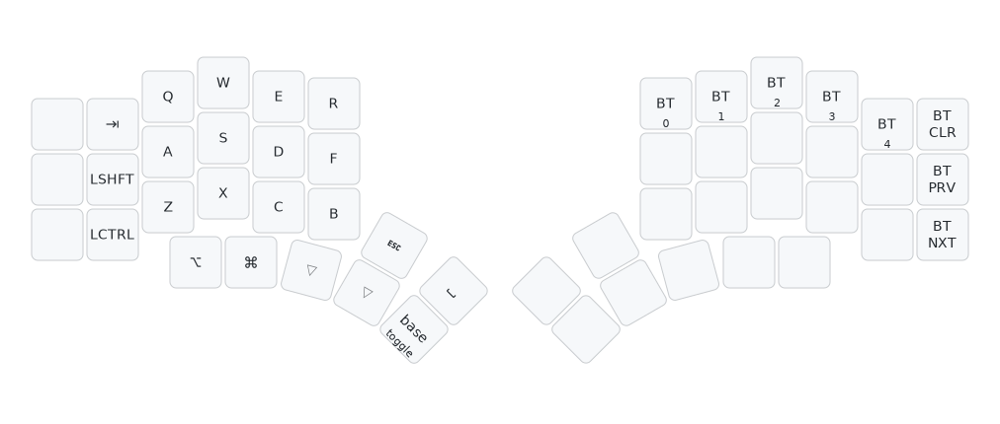

# ZMK Kyria Layout

You can find more insight into the layout logic in [my QMK userspace repository](https://github.com/jelmansouri/qmk_userspace/tree/jelmansouri).

I try to maintain the configuration as close as possible to QMK one, but there are always some specifities. For instance, Caps Word is implementd through a layer with shifted characters rather than through the built in feature, It was done so mainly to make symbols that are shifted numbers break the caps word.

